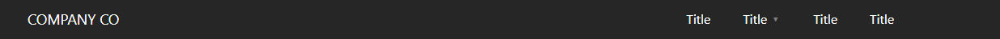

## slim-NAVIE 
##### Slim Navigation Escape



> Slim-NavieJS, also known as; Slim Navigation Expression, is a light navigation component driven by configurations, Achieving a Simple Navigation ready to use built on React.


#### Legacy

Slim-Navie JavaScript is a light navigation component driven by a configuration, was built back in the jQuery days
If you are interested in that version, Switch over to branch: `Legacy-jQuery`
So long jQuery <3...

#### React Ready

The new version is built in to use for react consumption, or ES6+.

## Installation

Download the script to your local root.

- ##### NPM CLI

  ```
  npm install @misterzik/slim-navie --save 
  ```

- ##### Download [ZIP](https://github.com/misterzik/slim-navie/archive/master.zip) or Clone Project

  ```
  git clone https://github.com/misterzik/slim-navie.git
  ```

## Usage

Slim-Navi is simple and fast to use; After installing the package on your dependencies folder make sure to include it on your React App;

### APP

```
import { SlimNav } from "@misterzik/slim-navie"
```

### Styles

```
import "@misterzik/slim-navie/css/slim-navie.css"
```

### Configuration

Slim-Navie is configuration driven, In order for the menu to be build you need to pass a configuration;

#### Config:

Skeleton build up.

```
const NavConfig = {
	brand: 'Company CO',
    customClass: { 
		enabled: true, 
		className: 'demo-test' 
	},
	data: [
		...Read Below ...
	]
}
```

#### Config Data:

Skeleton to build single link.

```
data: [
	{
		id: 0,
		title: "Title",
		alt: "Title Alt",
		href: "/home",
		target: "_self",
		_isHash: false,
		_isDropdown: false,
		dropdown: [{}],
		_hasRouter: false,
	},
	{
		id: 1,
		title: "Title",
		alt: "Title Alt",
		href: "#",
		target: "_self",
		_isHash: false,
		_isDropdown: true,
		dropdown: [
			{
			title: "Dropdown Title",
			alt: "",
			href: "/#dropdown",
			target: "_self",
			_isHash: false,
			},
			{
			title: "Dropdown Title",
			alt: "",
			href: "/#dropdown-title",
			target: "_self",
			_isHash: false,
			},
		],
		_hasRouter: false,
	},
]
```

## React Component

```
<SlimNav config={NavConfig}
	float={'right'}
	theme={'dark'}>
	    COMPANY CO
</SlimNav>
```

## Themes

Slim-Navi comes with two pre-defined themes, you can choose from 'light' or 'dark' theme by switching the theme option when using the handle. Float takes care of the position of the list of links.


## Required Plugins

| Plugin       | Required            |
| ------------ | ------------------- |
| React        | Component for React |
| React-Router | Highly Recommended  |


## Development


Want to contribute? Great, make a pull with your request and we will review it!


### Where is the code?

We keep the code on a private Repository, Once authorize you will be granted access.

## License

MIT
